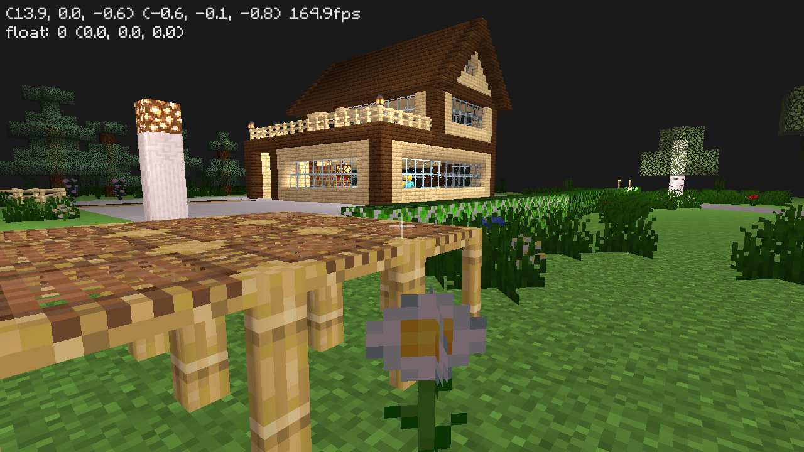

# Aperture Demo



The demo of project [Aperture](https://github.com/STARRY-S/Aperture).

## Dependencies

- GLFW3
- cglm
- Aperture

The Minecraft OBJ file used in this demo is generated by [jMc2Obj](https://github.com/jmc2obj/j-mc-2-obj).

Font: https://www.fontspace.com/roboto-remix-font-f26577

## Usage

> Build & Install [Aperture](https://github.com/STARRY-S/Aperture) before build this demo.

Clone and build:

```console
$ git clone https://github.com/STARRY-S/Aperture-demo.git && cd Aperture-demo
$ mkdir build && cd build
$ meson setup .. && meson compile ..
```

Install demo files:

```console
$ sudo meson install
$ aperture_demo
```

## License

> [Apache-2.0](/LICENSE)